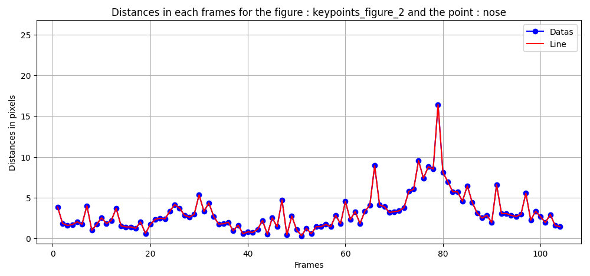

# Pose Detector from Trasce Project

## Overview
- Here is a code for predicting the rythme in theatrical staging
- TRASCE is a research in charge of finding trasces in thatrical field

## Technical information
- running on python 3.10 because of lap module
- I had to download separatly
- pip install lap

## INSTALLATION 
- create a virtualenv
- pip install -r requirements.txt
- pip install src/

### if there is problems
- pip install ultralytics
- pip install posedetector
- if it does not work do :
- pip install src/
- run **use_this.py**
- if lap is not installed, ultrlytics will search for it and install it
- if not, do :
- pip install lap
- and it should work

## HOW TO USE THIS PROGRAM
- clone this repo
- charge your videos in the **input-files** folder
- in the **examples** folder 
- add the name of the file you want to predict _yourfile_
- change the extension _(mp4)_ if needed

## PREDICTION
- run **01-predict.py**
- the prediction is in **export-results** folder
- you get a _video_ and a _json_

## RENAME ACTOR
- run **rename_actor.py**
- Then rename your actors and assign if they have multiple keypoint_figures
- It will change the name in the JSON file

## INTERPOLATE
- Sometimes some values are missing
- run **interpolate.py**
- It will add value in the JSON file with a mean of nearest 2 frame before and after

## GRAPH VISUALISATION
- run **graph_visualisation.py**
- You will  see a graph of the significant movement frame by frame

## the json file
- you get _frame by frame_ the pixel coordinates (x,y) for each 17 COCO keypoints and this for every person
- keypoint_figure_1 = id 1 in the video export

## Reading frame by frame
- use this [website](https://somewes.com/frame-count/)
- use VLC click **"E"** on your keyboard to go frame by frame _forward_
- but their's no key for going backward
- You can use the arrows on your keyboard to go 10 seconds backward < or forward >

### Image and video crédit 
- Vidéo de cottonbro studio: https://www.pexels.com/fr-fr/video/femme-hommes-travail-projecteur-6896247/
- Vidéo de cottonbro studio: https://www.pexels.com/fr-fr/video/hommes-femmes-scene-surveillance-6896248/

## RESULTS

